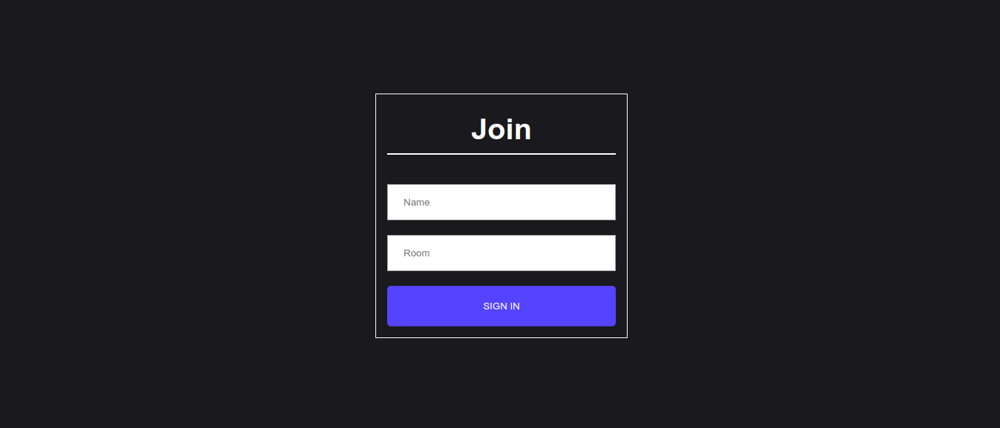
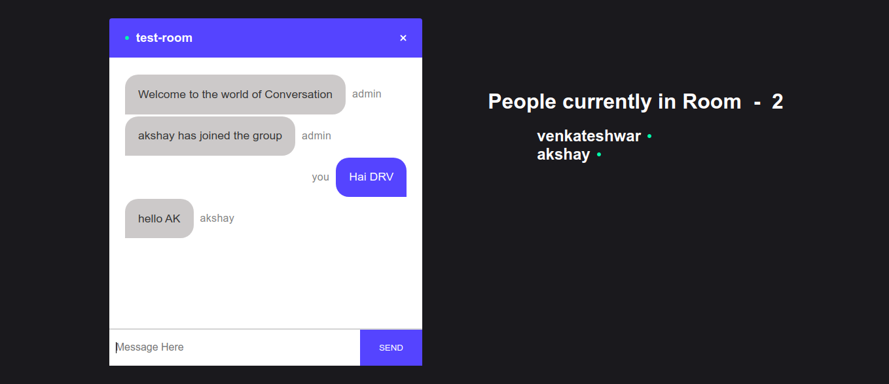
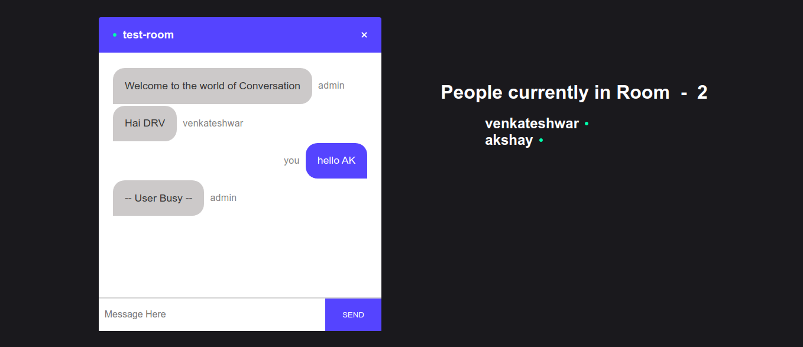
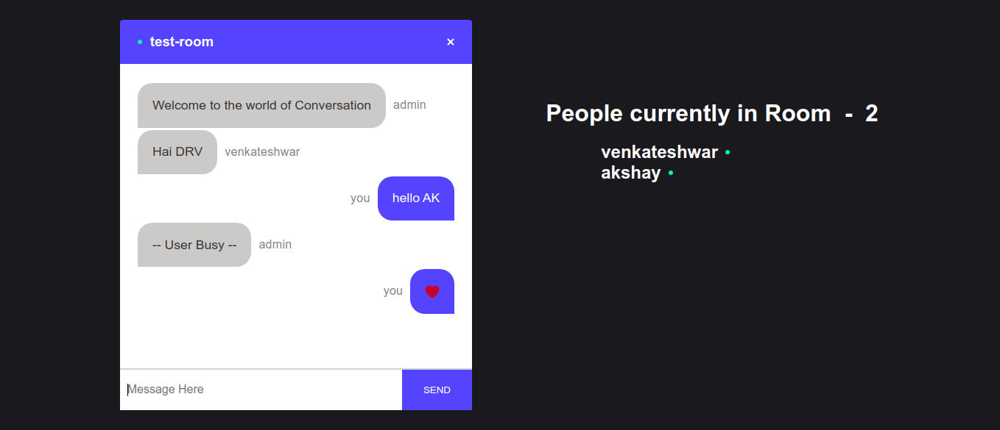

# Chat #

A simple Chat Room app build using __React__ and __Node__

# Demo #

See the live running app here - [Chat](https://5dd28f7334bd6a4711790455--romantic-goldberg-57dff2.netlify.com/)

# Installation #

##### Backend
1. Inside the project folder ``` chat ``` 
```
cd backend
npm i
```

2. Start the server using the command
```
nodemon index.js
```
# #
##### Front-end
1. Inside the project folder ``` chat ```
```
cd frontend
npm i
```
2.  Start the server using the command
```
npm start
```
3. Browse the URL __localhost:3000__ in the browser
# #

### ScreenShots

## Join


## Chat 


## Auto-reply - (Static content)
This static message will come only if a message is not replied for more than 30 secs


## Emoji

